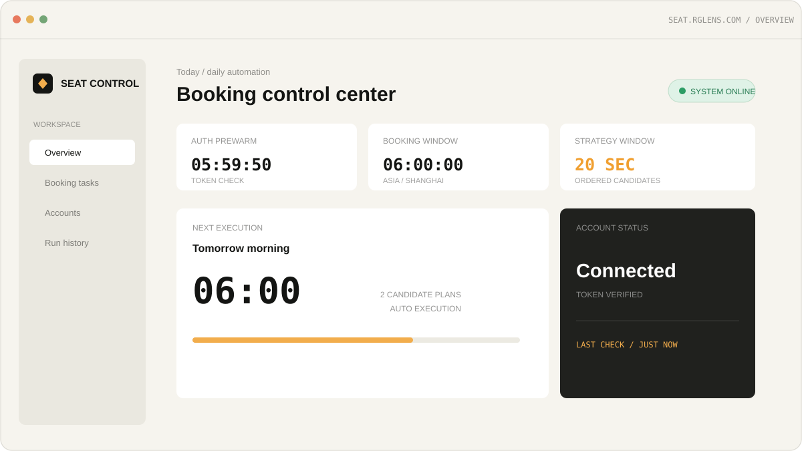
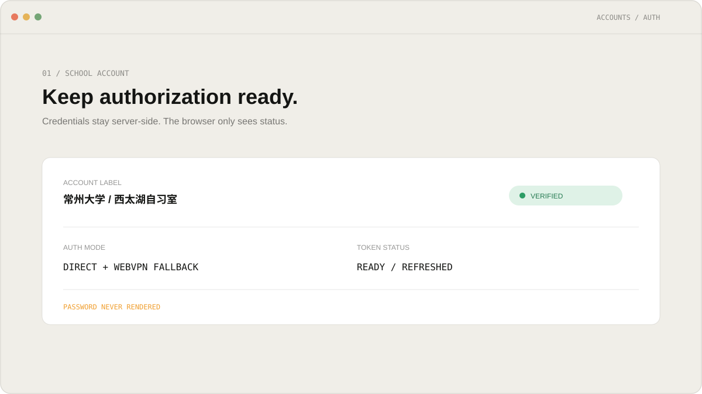
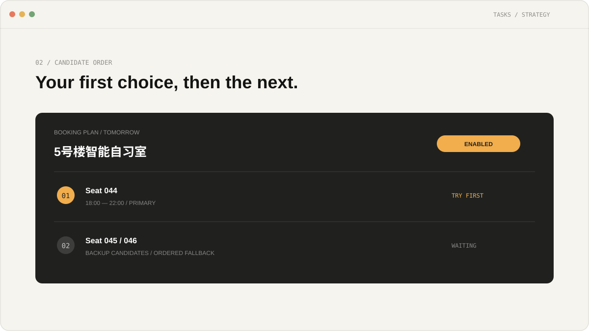
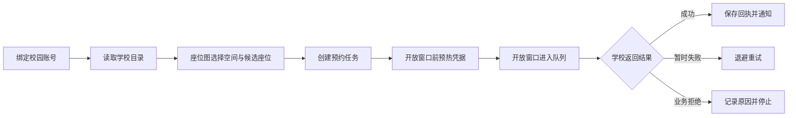

# 席定

> 面向高校学习空间的座位预约自动化平台。
>
> 选好空间、座位和时段，剩下的交给席定在开放窗口自动执行。

<p align="center">
  <a href="https://seat.rglens.com"></a>
  <a href="https://github.com/AVIDS2/seat-reserver/stargazers"></a>
  <a href="https://github.com/AVIDS2/seat-reserver/commits/master"></a>
  <a href="LICENSE"></a>
</p>

席定把高校里的自习室、图书馆学习空间和个人学习计划放进同一个工作台：账号授权一次，创建可重复执行的预约任务，系统在学校开放窗口自动尝试候选座位，并记录每一次结果。

它不是学校预约系统的替代页面，也不是把座位表重新做一遍。座位图用于浏览、筛选和选择；真正的预约由后端调度器在任务时间执行。

<p align="center">
  <a href="https://seat.rglens.com">打开席定</a>
  ·
  <a href="https://github.com/AVIDS2/seat-reserver/issues">报告问题</a>
  ·
  <a href="docs/README.md">查看文档地图</a>
</p>

## 目录

- [产品能力](#产品能力)
- [工作方式](#工作方式)
- [项目结构](#项目结构)
- [快速开始](#快速开始)
- [配置与部署](#配置与部署)
- [开发与验证](#开发与验证)
- [安全边界](#安全边界)
- [高校适配](#高校适配)
- [贡献](#贡献)
- [许可证](#许可证)

## 产品能力

### 对使用者

- **自动预约任务**：按每天、工作日或自定义星期执行；支持候选座位、候选时间段、错峰和失败重试。
- **座位图**：按高校、校区、楼栋、空间和日期查看座位状态；主座位和备选座位可以直接生成任务。
- **自习室与图书馆**：每个服务单独连接、单独保存授权状态；一个服务暂时不可用，不会阻塞任务编辑和其他服务。
- **预约记录**：查看平台运行结果和学校侧记录；在学校接口允许时在线取消预约。
- **账号隔离**：普通用户和 Pro 用户按产品规则绑定不同数量的校园账号，账号之间的凭据和任务互不串用。
- **自动恢复**：短时网络、上游维护或网关失败会进入退避重试，不要求用户反复刷新页面。
- **席定自习室**：用专注时长、排行榜、徽章和主题把一次预约延伸成持续的学习计划。
- **席定币与权益**：每日签到、活动奖励、邀请和 Pro 申请由服务端记账，兑换与授予有流水可追溯。

### 对开发者

- Next.js + shadcn/ui 的响应式控制台。
- NestJS + TypeORM + PostgreSQL 的平台 API。
- Redis + BullMQ + Nest Schedule 的持久化调度和执行队列。
- HttpOnly Cookie 会话、租户隔离、加密保存校园凭据和管理员脱敏视图。
- 高校适配集中在学校目录、认证、座位目录和预约执行边界，便于增加新的学校和校区。
- 可选的 OpenAI 兼容视觉模型链路，用于需要点选挑战的学校服务；未配置时回退到人工验证，不影响其他功能。

## 界面预览

席定的公开入口是产品介绍页，登录后进入预约控制台。下面的预览来自仓库内的前端资产：

<p align="center">
  
  
  
</p>

## 工作方式



座位图是任务配置的入口，不是任务执行的依赖。任务保存、编辑、暂停和重新启用不需要学校实时目录在线；只有到执行窗口，worker 才会验证凭据、读取必要目录并提交请求。

### 两条运行入口

| 入口 | 适合场景 | 位置 |
| --- | --- | --- |
| 席定平台 | 多账号、可视化任务、座位图、记录、通知、席定自习室 | `web/` + `api/` |
| Python CLI | 兼容已有个人脚本和简单 VPS 定时任务 | `seat_reserver.py` |

根目录 CLI 是独立的兼容工具，不会自动读取平台数据库，也不应把它的个人座位偏好、开放时刻或密钥写进产品文档。

## 项目结构

```text
.
├── web/                         # Next.js 控制台、移动端页面和设计系统
├── api/                         # NestJS 平台 API、调度器和 worker
├── seat_reserver.py             # 独立的 Python 预约 CLI
├── tests/                       # CLI 与采集工具测试
├── tools/                       # Reqable/HAR 脱敏与分析工具
├── deploy/                      # Compose 环境模板和代理配置示例
├── docs/                        # 产品、架构、部署和协议边界文档
├── docker-compose.platform.yml  # 平台生产编排
└── LICENSE
```

详细文档从 [docs/README.md](docs/README.md) 开始。长期维护的产品行为、架构决策和部署说明不重复堆在根 README 里。

## 快速开始

### 先体验

打开 [seat.rglens.com](https://seat.rglens.com)。生产环境使用同域 API 和 HttpOnly Cookie；不要把校园账号密码、Token 或模型密钥粘贴到浏览器控制台或 issue 中。

### 只启动前端

要求：Node.js 22+、Bun。

```bash
cd web
bun install
bun run dev
```

默认地址：<http://localhost:3000>

前端要连接真实平台 API 时，先参考 [`web/env.example.txt`](web/env.example.txt) 配置 `NEXT_PUBLIC_API_URL` 和 `INTERNAL_API_URL`。真实预约只会在 API 的 worker 中执行，前端开发服务器不会直接请求学校预约接口。

### 启动平台后端

平台后端需要 PostgreSQL、Redis 和一组服务端密钥。最小开发流程：

```bash
cd api
npm ci
npm run build
npm run start:dev
```

启动前请准备数据库环境；字段和生产默认值见 [`api/env-example-relational`](api/env-example-relational) 与 [`deploy/platform.env.example`](deploy/platform.env.example)。未配置真实学校服务参数时，可以先完成 API/Web 的界面和数据流开发，但不要把示例环境当成可预约配置。

### 运行独立 CLI

```bash
python3 -m py_compile seat_reserver.py
python3 seat_reserver.py --help
```

CLI 的账号、Token、请求签名和候选策略只从本地 `.env` 读取。复制 [`.env.example`](.env.example) 后填写自己的授权信息；真实 `.env` 永远不要提交。

## 配置与部署

### Docker Compose

平台编排包含 Web、API、PostgreSQL 和 Redis。先复制模板并替换所有 `replace-with-...` 占位符：

```bash
cp deploy/platform.env.example deploy/platform.env
# 编辑 deploy/platform.env，填写随机密钥、数据库密码和已获授权的服务参数
docker compose -f docker-compose.platform.yml \
  --env-file deploy/platform.env up -d --build
```

部署前建议在本地完成构建：

```bash
cd web
bun install
bun run typecheck
bun run lint:strict
bun run build
bun run prepare:runtime

cd ../api
npm ci
npm run build
npm run lint
```

生产环境应让反向代理对外提供 HTTPS；Web、API、数据库和 Redis 只监听内网或本机端口。不要执行 `docker compose down -v`，它会删除数据库卷。

健康检查：

```text
GET /api/v1/platform/health
```

期望结果类似：

```json
{"status":"ok","database":"ok","redis":"ok"}
```

完整的生产更新、迁移、资源限制和回滚说明见 [`docs/deployment/platform.md`](docs/deployment/platform.md)。

### 关键环境变量

| 变量 | 用途 |
| --- | --- |
| `PLATFORM_PUBLIC_URL` | 平台对外地址 |
| `PLATFORM_DB_*` | PostgreSQL 数据库配置 |
| `PLATFORM_AUTH_*` | JWT、刷新和确认 Token 密钥 |
| `PLATFORM_CREDENTIAL_ENCRYPTION_KEY` | 加密保存校园凭据 |
| `QUEUE_REDIS_URL` | BullMQ/队列 Redis 地址 |
| `SEAT_*` | 已获授权的学校座位服务参数 |
| `PLATFORM_VLM_*` | 可选的 OpenAI 兼容视觉模型配置 |
| `PLATFORM_STRIPE_*` | 可选的 Pro 支付配置 |

生产值只放在部署平台的 secret 或权限为 `600` 的环境文件中。仓库里的 example 文件只允许出现占位符。

## 开发与验证

### Web

```bash
cd web
bun run typecheck
bun run lint:strict
bun run build
bun run format:check
```

### API

```bash
cd api
npm run build
npm run lint
npm test -- --runInBand
```

### Python CLI

```bash
python3 -m py_compile seat_reserver.py
python3 seat_reserver.py --help
```

提交前至少运行与你修改范围对应的检查。涉及页面时请同时检查桌面端和移动端；涉及调度、账号或第三方服务时，补充对应的单元测试和只读健康检查。

## 安全边界

这是一个面向个人授权账号的自动化工具。使用前请确认学校服务、账号和自动化行为符合学校规则及相关服务条款。

- 只使用自己或明确获授权的校园账号。
- 不提交 `.env`、HAR、Cookie、Token、密码、HMAC key、支付密钥或视觉模型 API key。
- 不在 README、截图、日志、issue 或 PR 中公开真实身份信息和预约回执。
- 不通过提高并发、绕过风控或伪造身份扩大请求量；候选和重试应保持在必要范围内。
- 学校接口、验证码、开放窗口和预约规则发生变化时，应先做小范围只读验证，再更新适配器。
- 生产部署前轮换所有示例密钥，并限制数据库、Redis、API 管理端口的公网暴露。

平台会把学校侧失败、维护和暂时网络异常与账号凭据错误分开记录；不要因为一次 `5xx` 或维护响应就覆盖有效凭据。

## 高校适配

高校不是一个下拉框里的文案。每个高校/校区应有独立的目录、开放窗口、认证路线、座位状态映射和预约能力说明。新增学校时，优先补齐以下内容：

1. 学校目录和校区/空间的稳定 ID 与人性化名称。
2. 认证方式、凭据刷新、服务连接状态和失败分类。
3. 可查询日期、时段限制、取消规则和签到规则。
4. 座位图状态映射，以及任务执行时的候选策略。
5. 只读测试、失败回执、日志脱敏和文档更新。

当前仓库以常州大学的座位服务适配为首个生产链路；新的高校应通过独立 adapter 接入，不要把不同学校的字段和规则硬编码在同一套页面里。

## 贡献

欢迎提交 issue、文档改进和适配器改动。提交前请：

1. 说明问题或需求对应的用户场景。
2. 给出最小复现步骤；截图和日志必须脱敏。
3. 说明影响的高校、服务和页面范围。
4. 运行对应的类型检查、lint、构建和测试。
5. 如果改变了产品行为、接口、架构或部署方式，同步更新 `docs/` 中的权威文档。

涉及学校接口或账号认证的改动，请先在 issue 中描述风险和回滚方式，不要直接上传真实抓包文件。

## 致谢

本项目使用并改造了以下开源基础设施与 UI 体系，具体许可证和来源见 [`web/THIRD_PARTY_NOTICES.md`](web/THIRD_PARTY_NOTICES.md)：

- [Kiranism/next-shadcn-dashboard-starter](https://github.com/Kiranism/next-shadcn-dashboard-starter)
- [brocoders/nestjs-boilerplate](https://github.com/brocoders/nestjs-boilerplate)
- [shadcn/ui](https://ui.shadcn.com/)
- [Trophy Gamification UI](web/THIRD_PARTY_NOTICES.md)

## 许可证

本项目采用 [MIT License](LICENSE) 发布。第三方代码、字体、图标、组件和外部服务仍受其各自许可证与服务条款约束。
